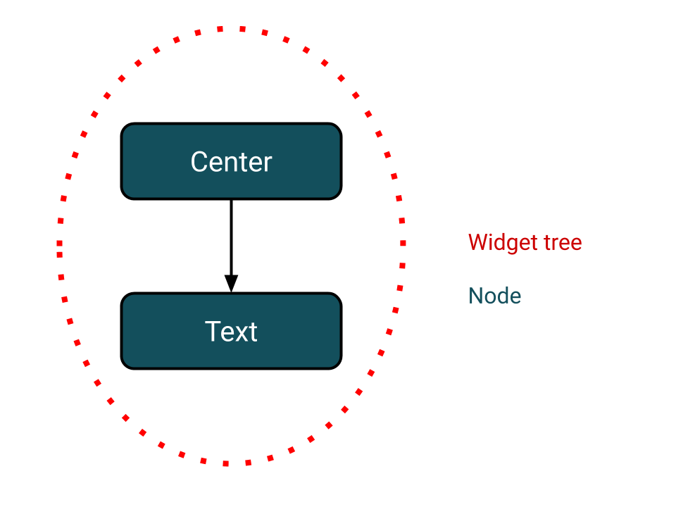
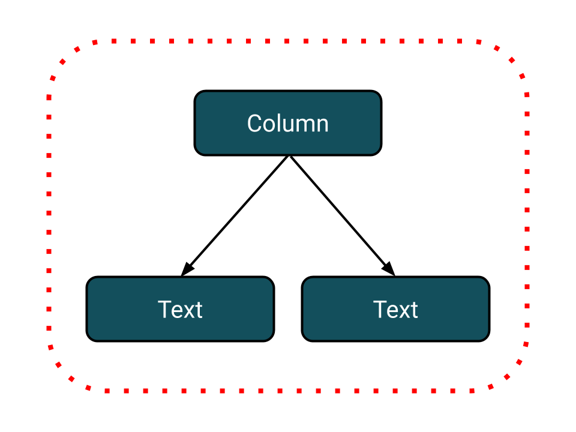

# Widgets

## "Everything is a widget"

At the beginning of the previous video, Martin talked about the versatility of "widgets" in Flutter.  In case you didn't catch it in the video, _**"widgets are the building blocks of Flutter."**_  They are used for everything from individual elements to entire pages of your apps. To that extent comes the phrase, "everything is a widget in Flutter." That's because, when you are working with Flutter, every part of your app—whether it be a button, a text field, a list, a text box, a navigation menu, etc.—_everything is a widget!_

## But... what is a widget?

According to Flutter, "The central idea is that you build your UI out of widgets. Widgets describe what their view should look like given their current configuration and state." As we discussed previously, the UI is the result of your widgets' build methods with the input of your current state. When the state of a widget changes, the widget rebuilds. The framework compares the new build to the old build to figure out the minimal changes required to update the app. That's what makes Flutter so quick!

Let's look at a basic example of a Flutter app:

```dart
import 'package:flutter/material.dart';

void main() {
  runApp(
    Center(
      child: Text(
        'Hello, world!',
        textDirection: TextDirection.ltr,
      ),
    ),
  );
}
```

This example creates two widgets: a `Center` widget and a `Text` widget. A widget’s main job is to implement a `build()`function, which describes the widget in terms of a _widget composition tree_. This example creates a very simple widget tree, consisting of only two nodes:



However, say we use a widget that accepts multiple children, like a `Row` or `Column`. Then the parent node will have multiple children nodes.



The more complex your app layouts become, the bigger the widget composition tree will become. Here is an example from the Flutter documentation:


## Stateless vs Stateful

