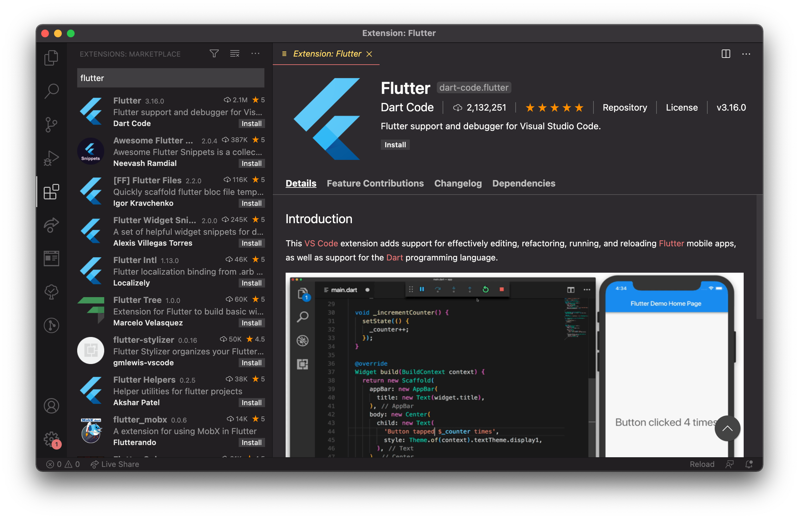
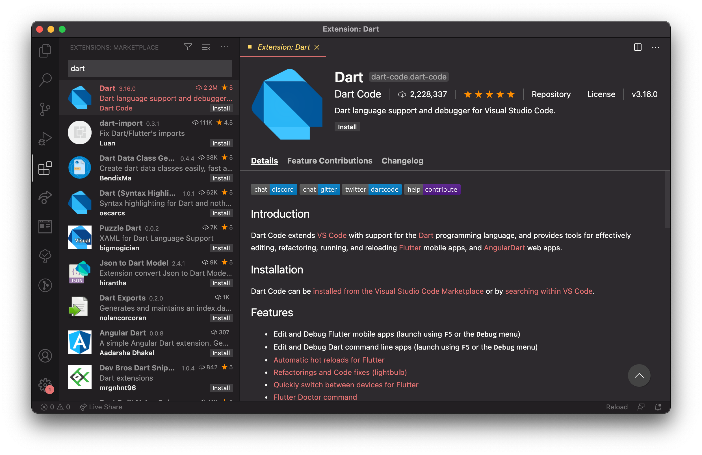

# Installing VS Code


If you have an administered system, your administrator should have already performed these steps! Otherwise, you'll need to get into contact with them to do so.


To code in Flutter, we need a text editor. VS Code is a great option for programming for all languages, especially Dart and Flutter. In this lesson, you will download and install VS Code and set up the Dart and Flutter plugins.

## Downloading and Installing


Note that these directions assume you are using macOS. If you are using Windows or Linux, follow the [official directions](https://code.visualstudio.com/docs/setup/windows).


* Visit [https://code.visualstudio.com/](https://code.visualstudio.com/) to download VS Code. Click the big blue "Download" button in the middle of the page.
* Once the download is completed, open the .zip file. It should be located in your Downloads folder, or a different default downloads location.
* Double click the .zip file. A new folder should be created title "VSCode", followed by the specific version. Double click that folder to jump inside.
* Drag `Visual Studio Code.app` to your Applications folder.
* Now, go to your Applications folder and open "Visual Studio Code".

Tada, you have now downloaded VS Code! Now we'll install the plugins.

## Plugins

* Open Visual Studio Code. On Mac, you can doing this by opening Finder and going to your Applications folder, or by going to your Launchpad and clicking the Visual Studio Code icon. On Windows, you can do this by going to your start menu and searching Visual Studio Code.
* Open the "Extensions" view by clicking the Extensions button.

* Search for "Flutter", and install the Flutter extension.

* Search for "Dart", and install the Dart extension.

## Setting up shell access

Sometimes it'll be easier for us to open a file in VS Code from the _command line_ \(also referred to as the _terminal_\). For this, we'll just need to perform a couple more steps.

* In the menu bar \(on the top of your screen\), go to View, and then select Command Palette.
* When a new window pops up, type in `shell command`. Click on `Shell Command: Install 'code' command in PATH`

That's it!

